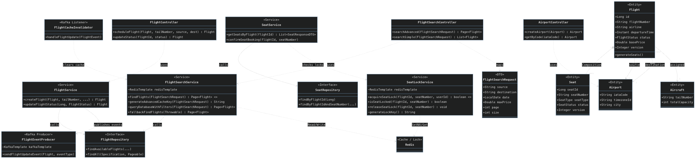

# Designing an Airline Management System

## 1. Module Overview

The Flight Service acts as the core inventory and scheduling engine for the Airline Management System. It is responsible for managing the lifecycle of flights, airports, and aircraft, while providing a high-performance, consistent interface for seat discovery and reservation. It serves as the "Source of Truth" for inventory state in the distributed architecture.

## 2. Functional Requirements
#### A. Flight Discovery (Search Engine)
1. **Advanced Search:** Users must be able to search for flights based on Source, Destination, and Date.
2. **Dynamic Filtering:** The system must support dynamic filtering by optional criteria including Price Range, Airline Preference, and Seat Availability.
3. **Pagination:** Search results must be paginated to handle large datasets efficiently.
4. **Metadata:** Responses must include comprehensive pagination metadata (Total Pages, Total Records) to support rich frontend UIs.

#### B. Inventory Management
1. **Seat Map Generation:** Upon scheduling a flight, the system must automatically generate a seat map based on the assigned Aircraft's capacity and configuration (Economy, Business, First Class).
2. **Real-Time Availability:** The system must distinguish between distinct seat states: AVAILABLE, LOCKED (Temporary hold), and BOOKED (Permanent).
3. **Concurrency Control:** The system must prevent "Double Booking" where two users attempt to reserve the same seat simultaneously.

#### C. Admin Operations
1. **Fleet Management:** Administrators can register Aircraft (with Tail Numbers and Capacity) and Airports (with IATA codes and Timezones).
2. **Scheduling:** Administrators can create routes and schedule flights.
3. **Status Updates:** Administrators can update flight statuses (e.g., ON_TIME $\to$ DELAYED), which must propagate immediately to users.

## 3. Non-Functional Requirements (Architecture)
#### A. High Performance (Caching Strategy)
* **Cache-Aside Pattern:** The search engine must utilize Redis to cache frequently accessed flight routes.
* **Intelligent Invalidation:** Cache entries must automatically expire after a set duration (TTL) or be evicted immediately upon a flight status change event.

#### B. Data Consistency (Distributed Locking)
* **Distributed Locks:** The system must implement a distributed locking mechanism using Redis (SETNX) to handle seat reservations in a clustered environment.
* **Optimistic Locking:** Database updates must utilize versioning (@Version) to prevent lost updates during concurrent transactions.

#### C. Fault Tolerance (Resilience)
* **Circuit Breakers:** The system must remain operational even if infrastructure components (e.g., Redis) fail. It should gracefully degrade to database-only mode without throwing 500 errors to the client.

#### D. Event-Driven Architecture
* **State Broadcasting:** Critical state changes (e.g., Flight Delays) must be published to a message broker (Kafka) to decouple the Flight Service from downstream consumers (Notification Service, Booking Service).

## 4. Key Entities & Relationships
1. **Flight:** The root aggregate. Contains departure/arrival times (UTC), base price, and current status.
   * ***Relationship:*** Has One Aircraft, Has Many Seats.
3. **Seat:** Represents a specific inventory unit. Holds state (AVAILABLE, LOCKED, BOOKED).
   * ***Constraint:*** Uses Composite Index (flight_id, seat_number) for O(1) locking performance.
5. **Airport:** Represents a global location with specific Timezone data (IANA ID) to handle cross-timezone calculations correctly.
6. **Aircraft:** Represents the physical asset with a fixed capacity.

## 5. Technology Stack (Implemented)
* **Core Framework:** Spring Boot 3.x (Java 17)
* **Database:** MySQL (Relational persistence)
* **Caching & Locking:** Redis (Lettuce Client)
* **Message Broker:** Apache Kafka
* **Resilience:** Resilience4j (Circuit Breaker)
* **API Documentation:** OpenAPI / Swagger
* **Serialization:** Jackson (Optimized for Java 8 Dates & Hibernate Proxies)

## UML Class Diagram

## Implementations

#### [Java Implementation](src/main/java/com/airlinemanagementsystem/flight/FlightApplication.java)