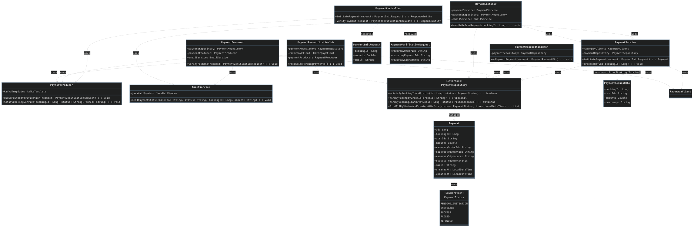

# Airline Payment Service

The **Payment Service** is the financial backbone of the Airline Management System. It handles payment processing, verification, refunds, and reconciliation using **Razorpay** as the gateway.

This service is designed to be **secure**, **idempotent**, and **resilient**, capable of handling distributed transactions in a microservices architecture.

---

## Key Strategies & Design Patterns

### 1. **Security: Backend-Validated Pricing**
* **Problem:** Malicious users can intercept frontend requests and modify the amount (e.g., changing ₹15,000 to ₹1).
* **Solution:** We **never trust the frontend** for critical financial data.
    * The **Booking Service** calculates the correct price and sends it securely to a Kafka topic (`payment-request-topic`).
    * The **Payment Service** consumes this message and stores the authoritative amount in the database with status `PENDING_INITIATION`.
    * When the user clicks "Pay", we fetch the amount from **our database**, ignoring any amount sent by the client.

### 2. **Saga Pattern: Automated Compensation (Refunds)**
* **Problem:** A user pays successfully, but the **Flight Service** fails to confirm the seat (e.g., race condition, seat taken by another user milliseconds prior).
* **Solution:** We implement a **Compensating Transaction**.
    * The Payment Service listens to the `booking-failure-topic`.
    * If a failure event is received for a paid booking, it automatically triggers a **Full Refund** via the Razorpay API.

### 3. **Idempotency**
* **Problem:** Network retries or user double-clicks might cause a user to be charged twice for the same booking.
* **Solution:** Before initiating any transaction, we check `existsByBookingIdAndStatus`. If a successful payment exists for a Booking ID, we reject the new request immediately.

### 4. **Reconciliation (Cron Job)**
* **Problem:** Sometimes the payment succeeds at the bank, but the callback to our server fails due to a network drop. The booking remains "Pending" indefinitely.
* **Solution:** A **Scheduled Job** runs every 15 minutes. It queries Razorpay for all "stuck" payments (INITIATED state) and updates our local database to match the actual bank status.

---

## Tech Stack & Justification

| Technology | Purpose | Why we used it? |
| :--- | :--- | :--- |
| **Java 17 & Spring Boot 3** | Core Framework | Industry standard for building robust, scalable REST APIs. |
| **Apache Kafka** | Event Streaming | Decouples the Booking and Payment services. Ensures no data is lost if one service goes down (Async communication). |
| **Razorpay** | Payment Gateway | Best-in-class support for INR (Indian Rupee), excellent developer API, and a robust "Test Mode" for safe simulation. |
| **MySQL** | Database | ACID compliance is non-negotiable for financial data. Used for storing transaction history and status. |
| **Docker & Compose** | Containerization | "Write once, run anywhere". Spins up the entire infrastructure (App + DB + Kafka + Redis) in one command. |

---

## Architecture Flow

1.  **Booking Created:** `Booking Service` sends message $\rightarrow$ Kafka (`payment-request-topic`) $\rightarrow$ `Payment Service` (Saves Amount).
2.  **User Pays:** Frontend calls `/initiate` $\rightarrow$ `Payment Service` creates Razorpay Order (using DB amount).
3.  **Verification:** Frontend calls `/verify` $\rightarrow$ Kafka (`payment-verification-topic`) $\rightarrow$ `Payment Service` verifies Signature.
4.  **Completion:** `Payment Service` $\rightarrow$ Kafka (`payment-events`) $\rightarrow$ `Booking Service` (Confirms Ticket).

---

## UML Class Diagram




#### Key Components Explained in the Diagram:
* PaymentController: Handles incoming HTTP requests for initiation and verification. 
* PaymentService: Contains the core logic for talking to Razorpay and managing the Payment entity. 
* PaymentRequestConsumer: The security gatekeeper that listens to the Booking Service to get the authentic price before the user even pays. 
* RefundListener: The "Safety Net" that listens for booking failures and triggers the processRefund logic in PaymentService. 
* PaymentReconciliationJob: The background worker that checks for stuck payments. 
* PaymentProducer: The messenger that talks back to Kafka to update the Booking Service.

---

## Setup & Configuration

### Prerequisites
* Docker & Docker Compose
* Java 17+ (for local dev)
* Razorpay Account (Test Mode)

### Environment Variables
Create a `.env` file or update `application.properties`:

```properties
# Database
SPRING_DATASOURCE_URL=jdbc:mysql://localhost:3306/payment_db?createDatabaseIfNotExist=true
SPRING_DATASOURCE_USERNAME=DB_USERNAME
SPRING_DATASOURCE_PASSWORD=DB_PASSWORD

# Kafka
SPRING_KAFKA_BOOTSTRAP_SERVERS=localhost:9092

# Razorpay (Get these from Razorpay Dashboard -> Settings -> API Keys)
RAZORPAY_KEY_ID=YOUR_RAZORPAY_KEY_ID
RAZORPAY_KEY_SECRET=YOUR_RAZORPAY_SECRET
```

## Docker Commands

### 1. Start the Infrastructure
Use this command to build the images and start all services (Payment, Booking, Flight, MySQL, Kafka, Redis, Zookeeper) in the background.

```bash
docker-compose up --build -d
```

### 2. Stop the Infrastructure
Stops all running containers and removes the networks, but preserves the data volumes (Database/Redis data remains safe).

```bash
docker-compose down
```

### 3. View Service Logs
Check the logs of specific services to debug issues in real-time.

```bash
docker logs -f payment-service
```

## Debugging & Verification Commands
Use these commands to "exec" (log in) to the running containers and verify data manually.

### 1. Kafka: Check Topics & Messages
Verify that services are communicating correctly.

* List all active topics:

```bash
docker exec -it kafka kafka-topics.sh --list --bootstrap-server localhost:9092
```

* Listen to 'payment-request-topic' (Booking -> Payment): Run this to see if the Booking Service is sending the secure price.
```bash
docker exec -it kafka kafka-console-consumer.sh --bootstrap-server localhost:9092 --topic payment-request-topic --from-beginning
```

### 2. Redis: Check Locks & Cache
Verify if seat locks are active or if flight search results are cached.

```bash
docker exec -it redis-container redis-cli
```

#### Redis Commands:

```bash
KEYS * # List all keys
GET "LOCK::FLIGHT_SEAT::1"  # Check if a specific seat lock exists
TTL "LOCK::FLIGHT_SEAT::1"  # Check how many seconds until lock expires
```

